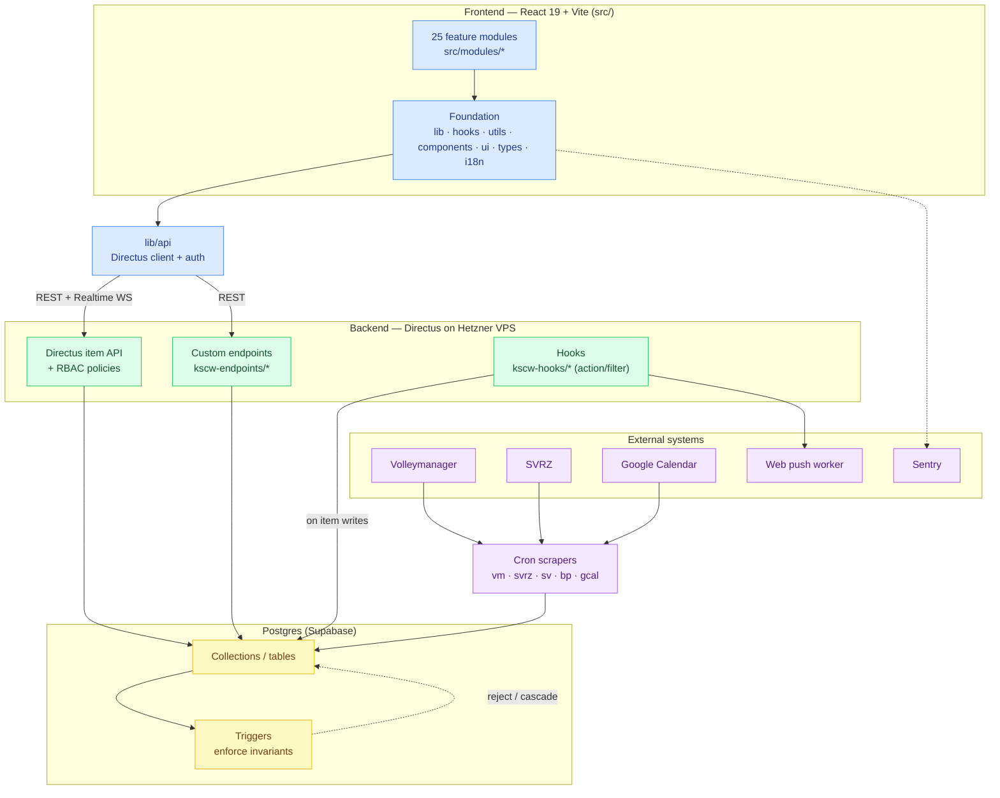

# wiedisync — Code Knowledge Graph

> **▶ Open [`graph.html`](./graph.html) in a browser** — a single self-contained, offline-capable page with an interactive force-directed dependency graph (area + file level, click-to-highlight, search, isolate-by-area) plus all five docs below with their Mermaid diagrams rendered. No server, no internet needed. Regenerate with `node docs/code-graph/gen-html.mjs`.

A layered map of the whole codebase, generated 2026-06-07. Two layers:

- **Layer 1 — mechanical** (`layer1-imports.md`): exact import edges parsed from every `src/` file. Nodes = areas/modules, edges = `import` statements. Ground truth, no interpretation.
- **Layer 2 — conceptual** (`layer2-*.md`): what the code *means* — data model, backend surface, and feature/domain flows — cross-linked back to the files.

Regenerate Layer 1 with: `node docs/code-graph/extract-graph.mjs && node docs/code-graph/gen-layer1.mjs`
Raw graph data (nodes + edges + per-file deps): `import-graph.json`.

| Document | Layer | What it covers |
|---|---|---|
| [layer1-imports.md](./layer1-imports.md) | 1 | Import dependency graph — areas, foundation, cross-module coupling, module→foundation matrix |
| [layer2-data-model.md](./layer2-data-model.md) | 2 | Directus collections / Postgres tables, FKs, M2M junctions, grouped by domain (ER diagrams) |
| [layer2-backend.md](./layer2-backend.md) | 2 | Custom endpoints, Directus hooks, Postgres triggers, cron syncs — and what each touches |
| [layer2-features.md](./layer2-features.md) | 2 | The 25 feature modules, their entry files, and cross-cutting domain flows (RSVP, absence, sync) |

## System map (the big picture)

How the layers connect end-to-end: the React app talks to Directus through one client (`lib/api`); Directus exposes the standard item API plus custom endpoints, runs hooks on writes, and sits on Postgres where triggers enforce invariants; external systems are pulled in by cron scrapers.

## How to read the layers

1. **Start here** for the architecture, then drop into a layer.
2. **Layer 1** answers "what imports what" — use it to find blast radius before a refactor (`import-graph.json` → `fileInfo[path].deps`).
3. **Layer 2** answers "what does this mean / where does the data live" — use the data-model + backend docs to trace a record from UI to table to trigger.
