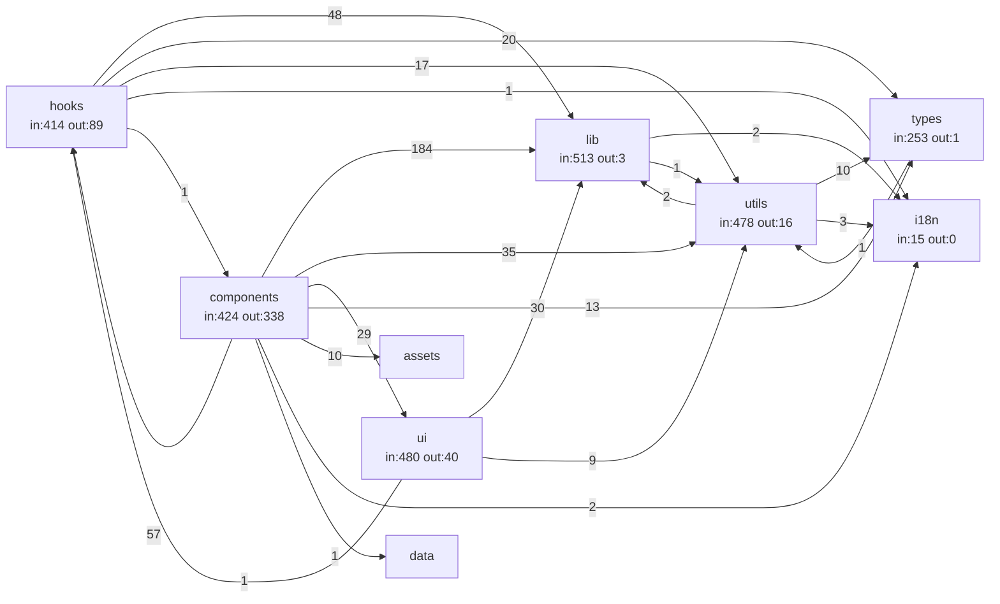
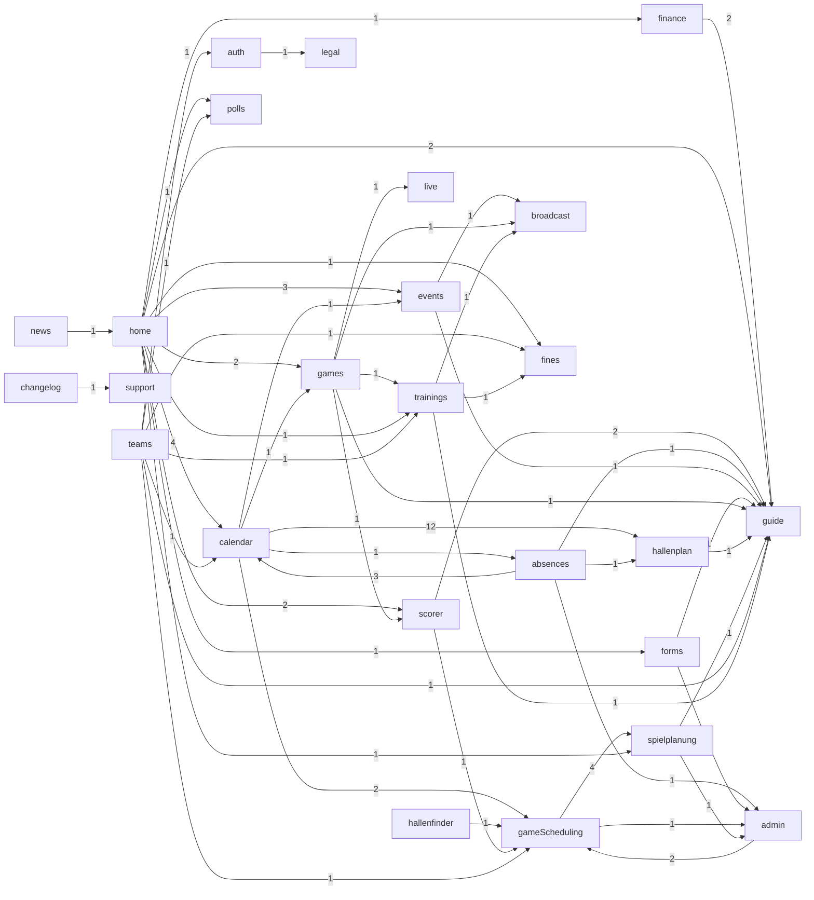

# Layer 1 — Import Dependency Graph (mechanical)

Derived by parsing every static + dynamic import in `src/` (`extract-graph.mjs`). **1077 files**, **230,008 LOC**, **37 areas**, **261 cross-area edges**. Edges are exact (resolved `@/` alias + relative paths); counts = number of import statements crossing the boundary.

## Areas (by size & coupling)

`in` = import statements pointing *into* the area (how depended-upon it is); `out` = imports it makes outward.

| Area | LOC | Files | In | Out |
|---|--:|--:|--:|--:|
| `components` | 42,312 | 262 | 424 | 338 |
| `i18n` | 38,941 | 184 | 15 | 0 |
| `modules/admin` | 38,406 | 116 | 26 | 414 |
| `modules/gameScheduling` | 24,400 | 82 | 18 | 272 |
| `modules/finance` | 6,949 | 32 | 7 | 132 |
| `modules/hallenplan` | 6,229 | 22 | 18 | 93 |
| `hooks` | 6,184 | 52 | 414 | 89 |
| `modules/games` | 5,405 | 15 | 5 | 140 |
| `modules/scorer` | 5,390 | 16 | 5 | 95 |
| `modules/auth` | 5,030 | 15 | 12 | 121 |
| `utils` | 4,379 | 44 | 478 | 16 |
| `ui` | 4,342 | 37 | 480 | 40 |
| `modules/teams` | 4,314 | 12 | 4 | 124 |
| `modules/calendar` | 4,231 | 20 | 9 | 103 |
| `modules/spielplanung` | 3,568 | 24 | 6 | 101 |
| `modules/events` | 3,469 | 8 | 6 | 99 |
| `modules/trainings` | 3,141 | 8 | 5 | 101 |
| `lib` | 3,093 | 14 | 513 | 3 |
| `modules/absences` | 2,709 | 12 | 2 | 96 |
| `modules/changelog` | 2,636 | 1 | 3 | 2 |
| `modules/home` | 2,362 | 8 | 2 | 78 |
| `modules/fines` | 1,925 | 8 | 5 | 42 |
| `modules/guide` | 1,738 | 34 | 17 | 14 |
| `modules/forms` | 1,704 | 9 | 5 | 47 |
| `types` | 1,380 | 3 | 253 | 1 |
| `modules/live` | 1,079 | 12 | 2 | 11 |
| `modules/polls` | 1,048 | 5 | 2 | 17 |
| `modules/broadcast` | 789 | 7 | 3 | 9 |
| `modules/hallenfinder` | 615 | 3 | 1 | 9 |
| `modules/feedback` | 532 | 1 | 1 | 9 |
| `app-root` | 405 | 2 | 0 | 90 |
| `modules/jsexport` | 370 | 2 | 1 | 9 |
| `modules/legal` | 256 | 2 | 3 | 0 |
| `modules/news` | 249 | 1 | 1 | 11 |
| `modules/support` | 201 | 2 | 4 | 5 |
| `SchedulingApp.tsx` | 186 | 1 | 0 | 33 |
| `modules/common` | 41 | 1 | 1 | 1 |

## Foundation layer (shared internals)

These areas are imported by everything; the diagram shows how they depend on *each other*. `i18n` and `types` are leaves (in-degree only — nothing they import internally is graphed).

## Cross-feature coupling (module → module)

Feature modules mostly fan *down* into the foundation and rarely import each other. The few module→module edges below are the real cross-feature dependencies — everything else is decoupled.

| From | To | Imports |
|---|---|--:|
| `calendar` | `hallenplan` | 12 |
| `gameScheduling` | `spielplanung` | 4 |
| `home` | `calendar` | 4 |
| `absences` | `calendar` | 3 |
| `home` | `events` | 3 |
| `admin` | `gameScheduling` | 2 |
| `calendar` | `gameScheduling` | 2 |
| `finance` | `guide` | 2 |
| `home` | `guide` | 2 |
| `home` | `games` | 2 |
| `home` | `scorer` | 2 |
| `scorer` | `guide` | 2 |
| `absences` | `guide` | 1 |
| `absences` | `hallenplan` | 1 |
| `absences` | `admin` | 1 |
| `auth` | `legal` | 1 |
| `calendar` | `absences` | 1 |
| `calendar` | `events` | 1 |
| `calendar` | `games` | 1 |
| `changelog` | `support` | 1 |
| `events` | `broadcast` | 1 |
| `events` | `guide` | 1 |
| `forms` | `admin` | 1 |
| `forms` | `guide` | 1 |
| `gameScheduling` | `admin` | 1 |
| `games` | `guide` | 1 |
| `games` | `live` | 1 |
| `games` | `scorer` | 1 |
| `games` | `broadcast` | 1 |
| `games` | `trainings` | 1 |
| `hallenfinder` | `gameScheduling` | 1 |
| `hallenplan` | `guide` | 1 |
| `home` | `trainings` | 1 |
| `home` | `spielplanung` | 1 |
| `home` | `forms` | 1 |
| `home` | `finance` | 1 |
| `home` | `fines` | 1 |
| `home` | `polls` | 1 |
| `news` | `home` | 1 |
| `scorer` | `gameScheduling` | 1 |
| `spielplanung` | `admin` | 1 |
| `spielplanung` | `guide` | 1 |
| `teams` | `trainings` | 1 |
| `teams` | `fines` | 1 |
| `teams` | `polls` | 1 |
| `teams` | `gameScheduling` | 1 |
| `teams` | `calendar` | 1 |
| `teams` | `auth` | 1 |
| `teams` | `guide` | 1 |
| `trainings` | `fines` | 1 |
| `trainings` | `broadcast` | 1 |
| `trainings` | `guide` | 1 |

## Module → foundation usage matrix

How heavily each feature module leans on each shared area (import-statement counts). Blank = no direct import.

| Module | `lib` | `hooks` | `utils` | `ui` | `components` | `types` | `i18n` |
|---|--:|--:|--:|--:|--:|--:|--:|
| `admin` | 44 | 35 | 70 | 140 | 104 | 18 | 1 |
| `gameScheduling` | 39 | 26 | 34 | 90 | 32 | 46 |  |
| `games` | 14 | 31 | 36 | 10 | 32 | 11 | 1 |
| `finance` | 5 | 38 | 29 | 35 | 20 | 3 |  |
| `auth` | 23 | 19 | 23 | 19 | 28 | 5 | 3 |
| `teams` | 17 | 18 | 34 | 17 | 22 | 9 |  |
| `spielplanung` | 10 | 15 | 27 | 16 | 9 | 22 |  |
| `trainings` | 7 | 20 | 25 | 9 | 29 | 7 | 1 |
| `events` | 9 | 25 | 18 | 8 | 30 | 7 |  |
| `scorer` | 12 | 14 | 24 | 11 | 17 | 14 |  |
| `hallenplan` | 12 | 10 | 23 | 13 | 16 | 18 |  |
| `absences` | 5 | 18 | 14 | 23 | 20 | 10 |  |
| `calendar` | 4 | 18 | 26 | 1 | 14 | 23 |  |
| `home` | 6 | 21 | 13 | 1 | 12 | 6 |  |
| `forms` | 10 | 9 | 4 | 12 | 9 | 1 |  |
| `fines` | 6 | 12 | 3 | 8 | 6 | 7 |  |
| `polls` | 2 | 3 | 3 | 5 | 2 | 2 |  |
| `guide` |  | 5 |  | 9 |  |  |  |
| `live` | 7 | 1 | 2 | 1 |  |  |  |
| `news` | 1 | 5 | 2 | 1 |  | 1 |  |
| `broadcast` | 1 |  |  | 7 | 1 |  |  |
| `feedback` | 2 | 1 | 2 | 4 |  |  |  |
| `jsexport` | 2 | 2 | 1 | 3 | 1 |  |  |
| `hallenfinder` | 1 | 1 | 1 | 4 | 1 |  |  |
| `support` | 1 | 1 | 1 | 2 |  |  |  |
| `changelog` |  |  |  | 1 |  |  |  |
| `common` |  |  |  | 1 |  |  |  |

## Top 25 cross-area edges

| From | To | Imports |
|---|---|--:|
| `components` | `lib` | 184 |
| `modules/admin` | `ui` | 140 |
| `modules/admin` | `components` | 104 |
| `modules/gameScheduling` | `ui` | 90 |
| `modules/admin` | `utils` | 70 |
| `components` | `hooks` | 57 |
| `hooks` | `lib` | 48 |
| `modules/gameScheduling` | `types` | 46 |
| `modules/admin` | `lib` | 44 |
| `modules/gameScheduling` | `lib` | 39 |
| `modules/finance` | `hooks` | 38 |
| `modules/games` | `utils` | 36 |
| `components` | `utils` | 35 |
| `modules/admin` | `hooks` | 35 |
| `modules/finance` | `ui` | 35 |
| `modules/gameScheduling` | `utils` | 34 |
| `modules/teams` | `utils` | 34 |
| `modules/gameScheduling` | `components` | 32 |
| `modules/games` | `components` | 32 |
| `modules/games` | `hooks` | 31 |
| `ui` | `lib` | 30 |
| `modules/events` | `components` | 30 |
| `components` | `ui` | 29 |
| `modules/finance` | `utils` | 29 |
| `modules/trainings` | `components` | 29 |

