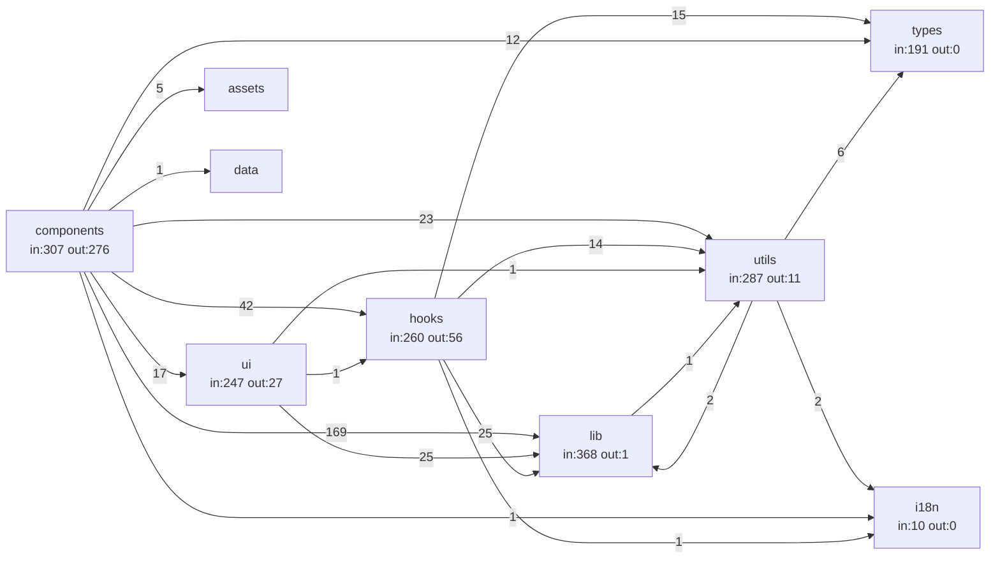
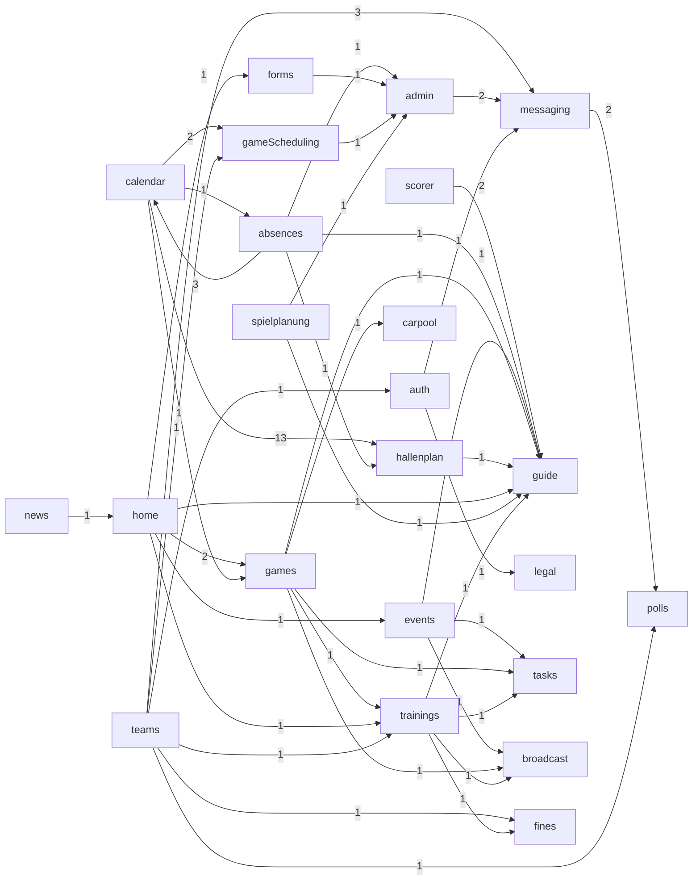

# Layer 1 — Import Dependency Graph (mechanical)

Derived by parsing every static + dynamic import in `src/` (`extract-graph.mjs`). **787 files**, **132,810 LOC**, **33 areas**, **227 cross-area edges**. Edges are exact (resolved `@/` alias + relative paths); counts = number of import statements crossing the boundary.

## Areas (by size & coupling)

`in` = import statements pointing *into* the area (how depended-upon it is); `out` = imports it makes outward.

| Area | LOC | Files | In | Out |
|---|--:|--:|--:|--:|
| `components` | 38,971 | 236 | 307 | 276 |
| `i18n` | 19,735 | 162 | 10 | 0 |
| `modules/admin` | 11,292 | 37 | 19 | 151 |
| `modules/gameScheduling` | 8,567 | 39 | 7 | 120 |
| `modules/hallenplan` | 4,980 | 20 | 15 | 74 |
| `modules/calendar` | 3,862 | 13 | 4 | 87 |
| `modules/games` | 3,499 | 12 | 5 | 100 |
| `modules/teams` | 3,407 | 9 | 4 | 104 |
| `modules/auth` | 3,194 | 10 | 9 | 93 |
| `modules/messaging` | 3,069 | 46 | 10 | 69 |
| `modules/scorer` | 2,914 | 9 | 2 | 54 |
| `hooks` | 2,901 | 29 | 260 | 56 |
| `modules/trainings` | 2,848 | 8 | 5 | 87 |
| `modules/spielplanung` | 2,841 | 20 | 1 | 86 |
| `modules/absences` | 2,671 | 12 | 2 | 91 |
| `ui` | 2,481 | 26 | 247 | 27 |
| `modules/events` | 2,004 | 4 | 2 | 68 |
| `utils` | 1,762 | 21 | 287 | 11 |
| `modules/forms` | 1,607 | 9 | 5 | 38 |
| `modules/home` | 1,456 | 3 | 2 | 38 |
| `modules/guide` | 1,412 | 25 | 11 | 14 |
| `lib` | 1,281 | 4 | 368 | 1 |
| `types` | 1,083 | 2 | 191 | 0 |
| `modules/fines` | 903 | 5 | 4 | 29 |
| `modules/broadcast` | 834 | 7 | 3 | 10 |
| `modules/polls` | 622 | 4 | 3 | 12 |
| `modules/tasks` | 550 | 4 | 3 | 13 |
| `modules/feedback` | 484 | 1 | 1 | 9 |
| `modules/carpool` | 440 | 4 | 1 | 14 |
| `modules/changelog` | 410 | 1 | 3 | 1 |
| `modules/legal` | 262 | 2 | 3 | 0 |
| `modules/news` | 241 | 1 | 1 | 10 |
| `app-root` | 227 | 2 | 0 | 70 |

## Foundation layer (shared internals)

These areas are imported by everything; the diagram shows how they depend on *each other*. `i18n` and `types` are leaves (in-degree only — nothing they import internally is graphed).

## Cross-feature coupling (module → module)

Feature modules mostly fan *down* into the foundation and rarely import each other. The few module→module edges below are the real cross-feature dependencies — everything else is decoupled.

| From | To | Imports |
|---|---|--:|
| `calendar` | `hallenplan` | 13 |
| `absences` | `calendar` | 3 |
| `teams` | `messaging` | 3 |
| `admin` | `messaging` | 2 |
| `calendar` | `gameScheduling` | 2 |
| `home` | `games` | 2 |
| `messaging` | `polls` | 2 |
| `scorer` | `guide` | 2 |
| `absences` | `guide` | 1 |
| `absences` | `hallenplan` | 1 |
| `absences` | `admin` | 1 |
| `auth` | `messaging` | 1 |
| `auth` | `legal` | 1 |
| `calendar` | `absences` | 1 |
| `calendar` | `games` | 1 |
| `events` | `tasks` | 1 |
| `events` | `broadcast` | 1 |
| `events` | `guide` | 1 |
| `forms` | `admin` | 1 |
| `gameScheduling` | `admin` | 1 |
| `games` | `guide` | 1 |
| `games` | `tasks` | 1 |
| `games` | `carpool` | 1 |
| `games` | `broadcast` | 1 |
| `games` | `trainings` | 1 |
| `hallenplan` | `guide` | 1 |
| `home` | `trainings` | 1 |
| `home` | `events` | 1 |
| `home` | `guide` | 1 |
| `home` | `forms` | 1 |
| `news` | `home` | 1 |
| `spielplanung` | `admin` | 1 |
| `spielplanung` | `guide` | 1 |
| `teams` | `trainings` | 1 |
| `teams` | `fines` | 1 |
| `teams` | `polls` | 1 |
| `teams` | `gameScheduling` | 1 |
| `teams` | `auth` | 1 |
| `trainings` | `fines` | 1 |
| `trainings` | `tasks` | 1 |
| `trainings` | `broadcast` | 1 |
| `trainings` | `guide` | 1 |

## Module → foundation usage matrix

How heavily each feature module leans on each shared area (import-statement counts). Blank = no direct import.

| Module | `lib` | `hooks` | `utils` | `ui` | `components` | `types` | `i18n` |
|---|--:|--:|--:|--:|--:|--:|--:|
| `admin` | 19 | 11 | 19 | 21 | 72 | 7 |  |
| `gameScheduling` | 18 | 5 | 15 | 42 | 13 | 26 |  |
| `teams` | 12 | 11 | 32 | 11 | 22 | 8 |  |
| `games` | 7 | 22 | 29 | 3 | 23 | 10 | 1 |
| `absences` | 5 | 17 | 13 | 22 | 18 | 10 |  |
| `spielplanung` | 9 | 10 | 24 | 12 | 9 | 20 |  |
| `trainings` | 7 | 18 | 19 | 8 | 23 | 7 | 1 |
| `auth` | 11 | 13 | 14 | 17 | 18 | 5 | 3 |
| `hallenplan` | 8 | 8 | 17 | 9 | 15 | 16 |  |
| `calendar` | 4 | 14 | 16 | 1 | 19 | 16 |  |
| `messaging` | 9 | 19 | 11 | 22 | 4 | 2 |  |
| `events` | 4 | 17 | 10 | 5 | 25 | 4 |  |
| `scorer` | 6 | 7 | 13 | 5 | 11 | 10 |  |
| `forms` | 10 | 5 | 4 | 11 | 6 | 1 |  |
| `home` | 3 | 10 | 5 |  | 11 | 3 |  |
| `fines` | 5 | 8 | 1 | 5 | 6 | 4 |  |
| `guide` |  | 5 |  | 9 |  |  |  |
| `carpool` | 1 | 3 | 1 | 7 |  | 2 |  |
| `tasks` | 1 | 4 |  | 3 | 1 | 4 |  |
| `polls` | 1 | 3 | 1 | 4 | 1 | 2 |  |
| `broadcast` | 1 |  | 1 | 7 | 1 |  |  |
| `feedback` | 2 | 1 | 2 | 4 |  |  |  |
| `news` | 1 | 3 | 1 | 1 | 2 | 1 |  |
| `changelog` |  |  |  | 1 |  |  |  |

## Top 25 cross-area edges

| From | To | Imports |
|---|---|--:|
| `components` | `lib` | 169 |
| `modules/admin` | `components` | 72 |
| `components` | `hooks` | 42 |
| `modules/gameScheduling` | `ui` | 42 |
| `modules/teams` | `utils` | 32 |
| `modules/games` | `utils` | 29 |
| `modules/gameScheduling` | `types` | 26 |
| `ui` | `lib` | 25 |
| `hooks` | `lib` | 25 |
| `modules/events` | `components` | 25 |
| `modules/spielplanung` | `utils` | 24 |
| `components` | `utils` | 23 |
| `modules/games` | `components` | 23 |
| `modules/trainings` | `components` | 23 |
| `modules/absences` | `ui` | 22 |
| `modules/games` | `hooks` | 22 |
| `modules/messaging` | `ui` | 22 |
| `modules/teams` | `components` | 22 |
| `modules/admin` | `ui` | 21 |
| `modules/spielplanung` | `types` | 20 |
| `modules/admin` | `lib` | 19 |
| `modules/admin` | `utils` | 19 |
| `modules/calendar` | `components` | 19 |
| `modules/messaging` | `hooks` | 19 |
| `modules/trainings` | `utils` | 19 |

