# Layer 2 — Backend (endpoints / hooks / triggers / crons)

The KSCW backend runs on Directus (Supabase Postgres) with two custom extensions: `kscw-endpoints` (custom REST routes under `/kscw/…`) and `kscw-hooks` (Directus item-event hooks + scheduled cron jobs). A layer of native Postgres triggers (`directus/scripts/0NN-*.sql`) enforces data-integrity invariants and fans out in-app notifications without touching Node. All four surfaces are documented below from the source files; effect descriptions are factual, with `(inferred)` where the behavior was deduced rather than read verbatim.

Route prefix is `/kscw`. Gating legend: **Public** = no auth (often Cloudflare Turnstile + IP rate-limit), **Auth** = any logged-in user, **Admin** = `accountability.admin === true` (Directus superuser), **Token** = unauthenticated but gated by a single-use opaque token, **Scoped** = auth + per-resource ownership/coach/TR check.

---

## Endpoints

There are ~100 custom routes. Split into two diagrams: (1) public + auth/member surface, (2) admin + sync + integration surface.

### Diagram 1 — Public & member-facing

```mermaid
graph LR
  subgraph Public
    EP1["POST /kscw/client-error"]
    EP2["POST /kscw/check-email"]
    EP3["GET /kscw/public/teams"]
    EP4["GET /kscw/public/team/:id"]
    EP5["GET /kscw/public/sponsors"]
    EP6["GET /kscw/public/events"]
    EP7["GET /kscw/public/mixed-tournament/non-member-count"]
    EP8["POST /kscw/verify-email"]
    EP9["POST /kscw/verify-email/confirm"]
    EP10["POST /kscw/set-password"]
    EP11["POST /kscw/register"]
    EP12["POST /kscw/registration"]
    EP13["POST /kscw/contact"]
    EP14["POST /kscw/password-request"]
    EP15["POST /kscw/newsletter/subscribe"]
    EP16["GET /kscw/ical*"]
    EP17["GET /kscw/public/forms/:slug"]
    EP18["POST /kscw/public/form-submit"]
    EP19["POST /kscw/team-invites/claim"]
    EP20["GET /kscw/team-invites/info/:token"]
  end
  subgraph Member
    EP30["POST /kscw/delete-account"]
    EP31["POST /kscw/scorer-delegation/accept|decline"]
    EP32["POST /kscw/web-push/subscribe"]
    EP33["GET /kscw/sv-licence/me"]
    EP34["POST /kscw/clubdesk-update"]
    EP35["GET|POST /kscw/messaging/*"]
    EP36["POST /kscw/activities/:type/with-participations"]
    EP37["POST /kscw/activities/:type/:id/broadcast"]
    EP38["POST /kscw/events/:id/notify"]
    EP39["GET /kscw/sync-status"]
    EP40["POST /kscw/team-invites/create|extend"]
    EP41["GET /kscw/forms/:id/stats"]
  end

  EP2 --> members
  EP3 --> teams
  EP4 --> teams & members & games & trainings & rankings & sponsors & halls
  EP5 --> sponsors
  EP6 --> events
  EP7 --> event_signups
  EP8 --> email_verifications
  EP9 --> email_verifications
  EP10 --> directus_users & members & email_verifications & password_reset_tokens
  EP11 --> directus_users & members & email_verifications & notifications
  EP12 --> registrations
  EP13 --> feedback
  EP16 --> games & events
  EP17 --> forms
  EP18 --> form_submissions & event_signups
  EP19 --> members & member_teams & team_invites
  EP30 --> members & directus_users
  EP31 --> scorer_delegations & games & notifications
  EP32 --> push_subscriptions
  EP33 --> sv_vm_check
  EP34 --> members & registrations
  EP35 --> conversations & messages & message_requests & blocks
  EP36 --> participations & trainings & games & events
  EP37 --> conversations & messages & notifications
  EP38 --> events & participations & notifications
  EP40 --> team_invites
  EP41 --> form_submissions & member_teams
```

### Diagram 2 — Admin, sync & integrations

```mermaid
graph LR
  subgraph AdminSync
    A1["POST /kscw/admin/sv-sync"]
    A2["POST /kscw/admin/bp-sync"]
    A3["POST /kscw/admin/vm-sync"]
    A4["POST /kscw/admin/svrz-sync"]
    A5["POST /kscw/admin/gcal-sync"]
    A6["POST /kscw/admin/schulferien-sync"]
    A7["GET /kscw/admin/sync-status"]
  end
  subgraph AdminOps
    B1["GET /kscw/admin/error-logs*"]
    B2["POST /kscw/admin/error-logs/annotate*"]
    B3["GET /kscw/admin/vps-metrics"]
    B4["GET /kscw/admin/slow-queries"]
    B5["GET /kscw/admin/migrations-status"]
    B6["POST /kscw/admin/audit"]
    B7["POST /kscw/admin/sql + /sql/ask + /sql/schema"]
    B8["GET /kscw/stats/*"]
    B9["POST /kscw/admin/feedback-to-github"]
    B10["POST /kscw/admin/scorer-reminders"]
    B11["GET|PATCH /kscw/wadmin/*"]
  end
  subgraph Terminplanung
    T1["POST /kscw/terminplanung/register"]
    T2["GET /kscw/terminplanung/slots/:token"]
    T3["POST /kscw/terminplanung/propose-home|away/:token"]
    T4["POST /kscw/terminplanung/admin/*"]
    T5["POST /kscw/admin/terminplanung/*"]
  end

  A1 --> games & rankings & sync_runs
  A2 --> games & rankings & sync_runs
  A3 --> members & teams & sv_vm_check & sync_runs
  A4 --> game_scheduling_opponents & svrz_spielplaner_contacts & sync_runs
  A5 --> events & sync_runs
  A6 --> halls & sync_runs
  A7 --> sync_runs
  B1 --> error_annotations & members & teams & games
  B2 --> error_annotations
  B6 --> user_logs
  B7 --> directus_db["arbitrary SQL read"]
  B8 --> stat_views
  B9 --> feedback & GitHub_API
  B10 --> games & notifications
  B11 --> directus_collections["scoped collections"]
  T1 --> game_scheduling_opponents
  T2 --> game_scheduling_slots & game_scheduling_opponents
  T3 --> game_scheduling_slots & games
  T4 --> games & game_scheduling_slots
  T5 --> game_scheduling_seasons & game_scheduling_invites
```

### Endpoint table

| Route | Method | Reads / Writes | Gating |
|---|---|---|---|
| `/kscw/client-error` | POST | W: JSONL error log | Public (IP rate-limit 30/min) |
| `/kscw/check-email` | POST | R: members, directus_users, member_teams, teams | Public (Turnstile + 10/min IP) |
| `/kscw/public/teams` | GET | R: teams (active) | Public |
| `/kscw/public/team/:id` | GET | R: teams, member_teams, members, teams_coaches, games, trainings, rankings, sponsors, halls | Public |
| `/kscw/public/sponsors` | GET | R: sponsors | Public |
| `/kscw/public/events` | GET | R: events (club-wide only; excludes events_teams/events_members) | Public |
| `/kscw/public/mixed-tournament/non-member-count` | GET | R: event_signups | Public |
| `/kscw/verify-email` | POST | W: email_verifications; sends OTP email | Public (3/h email, 10/h IP) |
| `/kscw/verify-email/confirm` | POST | R/W: email_verifications | Public (5/15min email) |
| `/kscw/set-password` | POST | R/W: directus_users, members, email_verifications, password_reset_tokens | Public/Token/Auth (3 modes) |
| `/kscw/register` | POST | W: directus_users, members; R: email_verifications; W: notifications + coach email/push | Public (post-OTP) |
| `/kscw/registration` + `/registration/:id/files` | POST | W: registrations, directus_files | Public (Turnstile) |
| `/kscw/contact` | POST | W: feedback; sends contact email | Public (Turnstile) |
| `/kscw/password-request` | POST | W: password_reset_tokens; sends reset email | Public (rate-limited) |
| `/kscw/newsletter/subscribe|verify|unsubscribe` | POST | W: newsletter_subscribers | Public |
| `/kscw/newsletter/digest` | POST | R: many; sends digest email | Admin / cron |
| `/kscw/ical`, `/ical/volleyball`, `/ical/basketball` | GET | R: games, events | Public (iCal feed) |
| `/kscw/public/forms/:slug` | GET | R: forms | Public |
| `/kscw/public/form-submit` | POST | W: form_submissions, event_signups | Public (Turnstile + 8/10min IP) |
| `/kscw/forms/:id/stats` | GET | R: form_submissions, member_teams | Scoped (Sport Admin / coach / TR of form) |
| `/kscw/forms/:id/remind` | POST | W: notifications/push to non-responders | Scoped (per-form, rate-limited) |
| `/kscw/team-invites/info/:token` | GET | R: team_invites, teams | Token |
| `/kscw/team-invites/create` | POST | W: team_invites | Scoped (admin / coach / TR) |
| `/kscw/team-invites/claim` | POST | W: members, member_teams, team_invites | Public (Token + 5/15min IP) |
| `/kscw/team-invites/extend` | POST | W: members | Scoped (admin / coach / TR) |
| `/kscw/delete-account` | POST | DEL: members (cascade) + directus_users | Auth (self) / Admin (any) |
| `/kscw/scorer-delegation/accept` `/decline` | POST | W: scorer_delegations, games, notifications + push | Auth (recipient only) |
| `/kscw/sv-licence/me` | GET | R: sv_vm_check | Auth (self) |
| `/kscw/clubdesk-update` | POST | R/W: members, registrations | Auth (self ownership) |
| `/kscw/web-push/vapid-public-key` | GET | — | Public |
| `/kscw/web-push/subscribe` `/unsubscribe` `/test` | POST | W: push_subscriptions; sends push | Auth |
| `/kscw/activities/:type/with-participations` | POST | R: trainings/games/events + participations (single round-trip) | Auth |
| `/kscw/activities/:type/:id/broadcast` `/broadcast/preview` | POST | W: conversations, messages, notifications + push/email | Scoped (sender member resolved) |
| `/kscw/events/:id/notify` | POST | R: events, participations; W: notifications + push/email | Scoped (admin or event creator; email = admin/creator only) |
| `/kscw/messaging/*` (~30 routes) | GET/POST/PATCH/DELETE | conversations, conversation_members, messages, message_reactions, message_requests, blocks, polls, poll_votes, message_reports | Auth (+ membership/moderator/owner checks) |
| `/kscw/sync-status` | GET | R: sync_runs | Auth |
| `/kscw/admin/sv-sync` | POST | scrape SwissVolley → games, rankings; W: sync_runs | Admin |
| `/kscw/admin/bp-sync` | POST | scrape Basketplan → games, rankings; W: sync_runs | Admin |
| `/kscw/admin/vm-sync` | POST | spawn `vm-sync-check.mjs` (Volleymanager); W: sync_runs | Admin (fire-and-forget 202) |
| `/kscw/admin/svrz-sync` | POST | spawn `svrz-scheduling-sync.mjs`; R: svrz_spielplaner_contacts; W: sync_runs | Admin (fire-and-forget 202) |
| `/kscw/admin/gcal-sync` | POST | sync Google Calendar → events; W: sync_runs | Admin |
| `/kscw/admin/schulferien-sync` | POST | sync school-holidays; W: sync_runs | Admin |
| `/kscw/admin/sync-status` | GET | R: sync_runs (age_seconds) | Admin |
| `/kscw/admin/error-logs` `/dates` `/annotations` | GET | R: JSONL logs, error_annotations, members, teams, games | Admin |
| `/kscw/admin/error-logs/annotate` `/annotate-bulk` | POST | W: error_annotations | Admin |
| `/kscw/admin/vps-metrics` | GET | reads /proc, df, nproc | Admin |
| `/kscw/admin/slow-queries` | GET | R: pg_stat_statements | Admin |
| `/kscw/admin/migrations-status` | GET | R: kscw_migrations | Admin |
| `/kscw/admin/audit` `/audit/stats` | POST/GET | R: user_logs (audit trail) | Admin (superuser) |
| `/kscw/admin/sql` `/sql/ask` `/sql/schema` | POST/GET | arbitrary read-only SQL / NL→SQL via LLM | Admin (superuser only) |
| `/kscw/stats/*` (9 routes) | GET | R: stat views | Admin (`requireAdmin` middleware) |
| `/kscw/admin/feedback-to-github` | POST | R: feedback, members; W: feedback; GitHub Issues API | Admin |
| `/kscw/admin/scorer-reminders` `/dry-run` | POST | R: games; W: notifications + push | Admin |
| `/kscw/wadmin/me` + `/:section/items/*` + `/admins` | GET/POST/PATCH/DELETE | section-scoped Directus collections | Scoped (wadmin section grants) |
| `/kscw/wadmin/scorer_courses/opnform/...` | GET/DELETE | OpnForm submissions proxy | Scoped (wadmin) |
| `/kscw/opnform/forms/:slug/count|submissions` | GET/DELETE | OpnForm API proxy | Public count / Admin submissions |
| `/kscw/bugfixes/*` (issues, fix, status, deploy, dismiss, reopen, webhook, public) | GET/POST | error_annotations, AI auto-fix pipeline, git deploy | Admin (`/public` is Public) |
| `/kscw/terminplanung/register` | POST | W: game_scheduling_opponents | Public (Turnstile) |
| `/kscw/terminplanung/slots/:token` | GET | R: game_scheduling_slots, opponents | Token |
| `/kscw/terminplanung/propose-home|away/:token` | POST | W: game_scheduling_slots, games | Token |
| `/kscw/terminplanung/set-language/:token` | POST | W: game_scheduling_opponents | Token |
| `/kscw/terminplanung/admin/{confirm-home,confirm-away,generate-slots,finalize-notify,block-slot}` | POST | W: games, slots, blocks; sends email | Admin |
| `/kscw/terminplanung/admin/svrz-sync` | POST | spawn SVRZ scheduling sync | Admin |
| `/kscw/admin/terminplanung/{restore-season,archive-season,rollover-season}/:id` | POST | W: game_scheduling_seasons | Admin |
| `/kscw/admin/terminplanung/invites*` (create, list, reissue, revoke, import-from-svrz, svrz-clubs) | GET/POST | W: game_scheduling_invites | Admin |

---

## Hooks

`kscw-hooks/src/index.js` registers Directus item-event hooks (`filter` = before-write mutation/validation, `action` = after-write side-effect) plus `init` middleware. Helpers live in `audit.js`, `sanitize-html.js`, `slot-cascade.js`. Push/email fan-out flows through `push-i18n.js` (`sendLocalizedPush`, 5-locale buckets) in the endpoints extension.

```mermaid
graph LR
  H1["filter items.create"] --> SAN["sanitize HTML + Turnstile (members/feedback/event_signups)"]
  H2["filter members.items.update"] --> ROLEGUARD["block non-admin role escalation"]
  H3["action members.items.update"] --> ROLESYNC["syncMemberRole + auto-confirm backfill"]
  H4["action auth.login"] --> LASTSEEN["update members.last_seen"]
  H5["filter/action users.delete"] --> CASCADE1["cascade-delete member + cleanup"]
  H6["filter/action members.items.delete"] --> CASCADE2["cleanup linked directus_user"]
  H7["action teams_coaches/responsibles.items.create"] --> ROLESYNC
  H8["filter teams_coaches/responsibles.items.delete"] --> JUNCGUARD["defer + re-sync role"]
  H9["filter absences.items.create/update"] --> ABSMETA["stamp editor meta"]
  H10["action absences.items.create/update/delete"] --> ABSDECLINE["autoDeclineForAbsence + notify 3rd party"]
  H11["action team_requests.items.create"] --> JOINNOTIF["notify coaches/TR (in-app+email+push)"]
  H12["filter announcements.items.create/update"] --> ANNSAN["sanitize + schedule fanout"]
  H13["action announcements.items.create/update"] --> ANNFAN["notifyAnnouncementPublished (push fanout)"]
  H14["action trainings.items.create"] --> AUTORSVP["applyTrainingAutoRSVP"]
  H15["action games.items.create"] --> AUTORSVPG["applyGameAutoRSVP"]
  H16["action events.items.create"] --> AUTORSVPE["event auto-confirm (member opt-in)"]
  H17["action trainings.items.update"] --> CANCELNOTIF["notifyTrainingCancelled (push+notif)"]
  H18["action games.items.update"] --> GAMEDATE["reschedule notify"]
  H19["action teams.items.update"] --> TEAMAUTOCONF["backfill auto-confirm on feature toggle"]
  H20["action events.items.update"] --> EVENTDATE["event-date change handling"]
  H21["action hall_closures.items.*"] --> CLOSURE["applyClosureAutoCancel (cancel trainings + unwind RSVP)"]
  H22["filter members.items.read"] --> PRIVACY["null hide_phone/hide_email/PII for non-self"]
  H23["action items.update (registrations)"] --> REGAPPROVE["approve/reject → member create + email"]
  H24["filter games.items.create"] --> MANUALGAME["scope manual game to user team"]
  H25["filter participations.items.create"] --> PARTICAUTO["absence-override + auto-confirm + edit attribution"]
  H26["filter participations.items.update"] --> PARTEDIT["edit attribution"]
  H27["filter/action hall_slots.items.*"] --> SLOTCASCADE["slot-cascade: generate/regenerate trainings"]
  H28["action forms.items.create/update"] --> FORMOPEN["notify roster on form open"]
  H29["filter form_submissions.items.create"] --> FORMVALID["validate answers vs field defs"]
  H30["action form_submissions.items.create"] --> FORMNOTIF["notifyFormSubmission"]
  H31["filter/action fines.items.create/update"] --> FINES["compute amount + notify member"]
  H32["init middlewares.before"] --> MW["request middleware (CORS/Turnstile wiring)"]
```

### Hook table

| Hook event | Trigger condition | Effect |
|---|---|---|
| `init('middlewares.before')` | App boot | Installs request middleware (early request wiring) |
| `filter('items.create')` | collection ∈ members/feedback/event_signups | Sanitize HTML; enforce Turnstile on public creates |
| `filter('members.items.update')` | payload has `role` | Block non-admin role escalation (system context trusted) |
| `action('members.items.update')` | `role` changed; or auto-confirm flag flipped on | `syncMemberRole`; backfill `confirmed` participations for upcoming activities (NOT EXISTS) |
| `action('auth.login')` | Any login | Update `members.last_seen`/login timestamp |
| `filter('users.delete')` + `action('users.delete')` | Directus user deleted | Cascade-delete linked member + owned data |
| `filter('members.items.delete')` + `action(...)` | Member deleted | Clean up linked `directus_users` row |
| `action('teams_coaches.items.create')` / `teams_responsibles.items.create` | Coach/TR junction insert | `syncMemberRole` (grant coach/TR role) |
| `filter('teams_coaches.items.delete')` / `teams_responsibles...` | Junction delete | Queue pending drain; re-sync role after (`drainPendingJunction`) |
| `filter('absences.items.create'/'update')` | Auth user | Stamp editor name/role meta onto absence row |
| `action('absences.items.create'/'update'/'delete')` | Absence written | `autoDeclineForAbsence` (UPDATE/INSERT declined participations) + notify coach/TR third party |
| `action('team_requests.items.create')` | Join request | `notifyTeamJoinRequest`: in-app notif + email + push to coaches/TR |
| `filter('announcements.items.create'/'update')` | Announcement write | Sanitize HTML; set/clear scheduled `published_at` |
| `action('announcements.items.create'/'update')` | Published | `notifyAnnouncementPublished` — per-locale push fanout (sets `fanout_sent_at`) |
| `action('trainings.items.create')` | New training | `applyTrainingAutoRSVP` (team/member auto-confirm pass) |
| `action('games.items.create')` | New game | `applyGameAutoRSVP` (guest_level=0 only) |
| `action('events.items.create')` | New event | Event auto-confirm for members opted-in (`event_auto_confirm`) |
| `action('trainings.items.update')` | `payload.cancelled === true` | `notifyTrainingCancelled` — in-app notif + per-locale push to team |
| `action('games.items.update')` | `date` changed | Reschedule-notify path |
| `action('teams.items.update')` | `features_enabled` has auto-confirm toggle | Backfill `confirmed` participations across upcoming activities |
| `action('events.items.update')` | `start_date` changed | Event-date change handling (inferred: re-notify) |
| `action('hall_closures.items.create'/'update'/'delete')` | Closure CRUD | `applyClosureAutoCancel` — cancel covered trainings + unwind RSVPs; reverse on delete |
| `filter('members.items.read')` | non-admin, non-self read | Null out `phone` (hide_phone), `email` (hide_email), other PII |
| `action('items.update')` | collection=registrations, status approved/rejected | Create member on approval; send localized email (5-locale CC buckets) |
| `filter('games.items.create')` | non-admin, `source='manual'` | Scope manual game to caller's team |
| `filter('scheduling_blocks.items.create')` | non-admin | Scope block to caller's team |
| `filter('participations.items.create')` ×3 | RSVP insert | (a) flip to declined if covering absence exists; (b) honour `excluded_guest_levels`; (c) stamp edit attribution |
| `filter('participations.items.update')` | RSVP update | Stamp edit attribution (editor name/role) |
| `filter('hall_slots.items.update')` + `action(...)` + `action('hall_slots.items.create')` + `filter('...delete')` | Slot CRUD | `slot-cascade`: generate/regenerate/delete `trainings` from slot (transaction-local notify silencer) |
| `action('forms.items.create')` / `forms.items.update` (status=open) | Form opened | Notify roster (push/notif) that a form is open |
| `filter('form_submissions.items.create')` | Submission | Validate `answers` against form `fields` definition |
| `action('form_submissions.items.create')` | Submission saved | `notifyFormSubmission` (coach/TR notification) |
| `filter('fines.items.create'/'update')` | Fine write | Compute amount from `fine_rules` tiers + window |
| `action('fines.items.create'/'update')` | Fine saved | Notify the fined member |

---

## Postgres triggers

All trigger functions pin `SET search_path = public` (migration 071 restored regressions). Notification triggers INSERT into `notifications` (in-app); the kscw-hooks crons + push helpers handle push delivery.

| Trigger | Table | Timing | Invariant / effect |
|---|---|---|---|
| `trg_slot_claims_validate` | slot_claims | BEFORE INS/UPD | Reject past-date claims; reject duplicate active claim on same hall_slot+date |
| `trg_members_shell_convert` | members | BEFORE UPDATE | On `wiedisync_active` false→true while shell, auto-set `shell=false` |
| `trg_members_coach_approval_guard` | members | BEFORE UPDATE | Block `coach_approved_team=true` unless a `member_teams` row exists |
| `trg_participations_guest_block` | participations | BEFORE INS/UPD | Block guests (`guest_level>0` on the **game's** team — scoped by migration 050) from confirming game participation |
| `trg_trainings_revoke_claims` | trainings | AFTER UPDATE | On un-cancel, revoke `slot_claims` freed by `cancelled_training` |
| `trg_games_notify` | games | AFTER INS/UPD/DEL | INSERT `notifications` for team on create/update/result/cancel/delete (skips past games) |
| `trg_trainings_notify` | trainings | AFTER INS/UPD/DEL | INSERT `notifications` for team; short-circuits on GUC `kscw.skip_trainings_notify` (migration 054, used by bulk slot-cascade) |
| `trg_events_notify` | events | AFTER INS/UPD/DEL | INSERT `notifications` for members of all teams in `events_teams` |
| `trg_scorer_delegation_validate` | scorer_delegations | BEFORE INSERT | Auto-set `same_team`; auto-accept same-team delegations |
| `trg_participations_clear_auto_marker` | participations | BEFORE UPDATE | On user-driven status change (marker unchanged), null `auto_declined_by` to detach from absence origin (reshaped by 028/038) |
| `trg_trainings_clear_auto_cancel_marker` | trainings | BEFORE UPDATE | On manual `cancelled` toggle, null `auto_cancelled_by_closure` / `auto_cancelled_by_trial` (extended by 055) |
| `trg_trainings_trial_transform` | trainings | AFTER INSERT | A new trial transforms any active same-date training in place (merge RSVPs, delete dup); at most one active training per (team,date) (056, generalized by 061) |
| `trg_messaging_protect_sentinel` | members | BEFORE DELETE | Prevent deletion of the `system@kscw.ch` sentinel member |
| `trg_messaging_teams_members_insert` | member_teams | AFTER INSERT | Insert `conversation_members` row for team conversation (archived = NOT chat_enabled) |
| `trg_messaging_teams_members_delete` | member_teams | AFTER DELETE | Archive (not delete) the member's team `conversation_members` row |
| `trg_messaging_member_team_chat_enabled` | members | AFTER UPD OF communications_team_chat_enabled | Toggle `archived` on the member's team conversation rows |
| `trg_messaging_teams_insert` | teams | AFTER INSERT | Create the team's group conversation + seed members |
| `trg_messaging_dm_autoaccept` | member_teams | AFTER INSERT | Promote pending `message_requests` between new teammate + current teammates to accepted DM (unless blocked) |
| `trg_participations_activity_chat_sync` | participations | AFTER INS/UPD/DEL | Keep `conversation_members` in sync with event activity_chat participations (event-only; banned → delete) |
| `trg_activity_chat_event_delete` | events | AFTER DELETE | Delete the event's `activity_chat` conversation (FK cascade handles children) |
| `trg_members_prevent_email_blanking` | members | BEFORE UPD OF email | Refuse setting an existing non-blank email to blank |
| `form_submissions_guard` | form_submissions | BEFORE INSERT | Allow only when form open, before `closes_at`, no duplicate (per-member dedup) |
| `form_submissions_update_guard` | form_submissions | BEFORE UPDATE | Allow self-edit of `answers` only while form open + before deadline (088) |
| (CASCADE FKs, migration 003/021/037) | member_teams, participations, notifications, absences, user_logs, scorer_delegations, poll_votes, slot_claims, carpools, junctions | ON DELETE | CASCADE member-owned data; SET NULL on games.organizer/events.organizer/feedback |

---

## Cron jobs

All crons are registered via `schedule(cron, fn)` in `kscw-hooks/src/index.js` (server-local time). Sync crons mint a service-account token (`getCronAccessToken`) and call the matching `/kscw/admin/*-sync` endpoint, then upsert a `sync_runs` heartbeat via `logCronRun` (`error-log.js`, migration 045). The `/status` dashboard reads `sync_runs`.

| Cron (schedule) | Source / trigger | What it does | Writes to |
|---|---|---|---|
| `*/5 * * * *` | announcements due | Fan out scheduled announcements past `published_at` | notifications + push; sets `fanout_sent_at` |
| `30 1 * * *` | absence sweep | Auto-decline participations for absent members (trainings/games/events) with no existing RSVP | participations |
| `0 2 * * *` | shell expiry | Deactivate shell members past `shell_expires` | members.kscw_membership_active |
| `0 3 * * *` | invite expiry | Mark pending `team_invites` past `expires_at` as expired | team_invites |
| `0 5 * * *` | delegation expiry | Mark pending `scorer_delegations` for past games as expired | scorer_delegations |
| `0 4 * * *` | notification cleanup | Delete notifications for past games/trainings/events | notifications |
| `0 7 * * *` | participation reminders | Notify members whose `respond_by` is tomorrow | notifications + push |
| `30 6 * * *` | daily reminders | Notify members of activities happening tomorrow (upcoming_activity) | notifications + push |
| `0 9 * * *` | shell reminder | Email shell members expiring in 10 days | members.shell_reminder_sent; email |
| `0 6 * * *` | SV sync | Scrape SwissVolley → games + rankings (calls `/admin/sv-sync`) | games, rankings, sync_runs |
| `5 6 * * *` | BP sync | Scrape Basketplan → games + rankings (calls `/admin/bp-sync`) | games, rankings, sync_runs |
| `0 4 * * 1` | VM sync (weekly Mon) | Spawn `vm-sync-check.mjs` — Volleymanager team names/leagues + referee licences | teams (name/full_name/league), members (referee_vb), sv_vm_check, sync_runs |
| `30 4 * * *` | SVRZ sync | Spawn `svrz-scheduling-sync.mjs` — game-scheduling contacts/feeds | game_scheduling_opponents, svrz_spielplaner_contacts, sync_runs |
| `0 4 * * *` | GCal sync | Sync Google Calendar → events (calls `/admin/gcal-sync`) | events, sync_runs |
| `30 4 1 * *` | Schulferien sync (monthly) | Sync school-holiday dates (calls `/admin/schulferien-sync`) | halls/holiday data, sync_runs |
| `0 3 1 5 *` | season refresh (May 1) | Refresh `teams.season` choice list (`refreshSeasonChoices`) | directus_fields (teams.season choices) |
| `30 3 * * *` | error-log cleanup | `cleanOldLogs()` — delete JSONL logs older than retention | JSONL log files |
| `0 3 * * *` | messaging retention | Hard-delete messages older than 12 months (Plan 05 retention) | messages |
| `0 2 * * *` | slot-cascade top-up | `topUpIndefiniteSlots` — roll forward trainings for indefinite slots + auto-RSVP | trainings, participations |
| `0 9 * * *` | fines reminder | Email members with open fines older than 14 days | fines reminder email |
