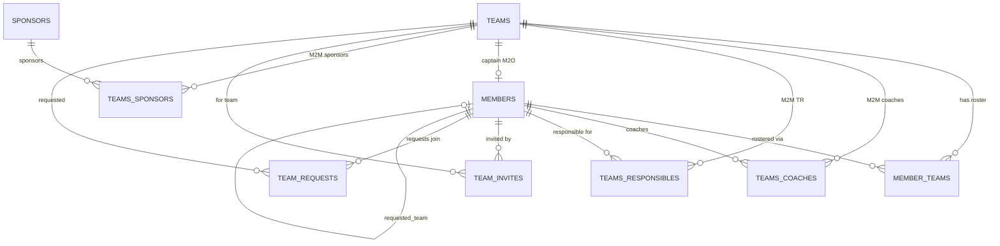
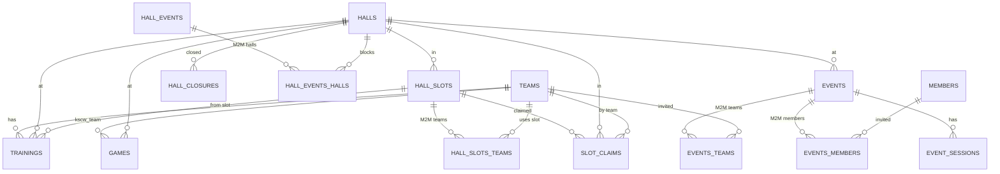
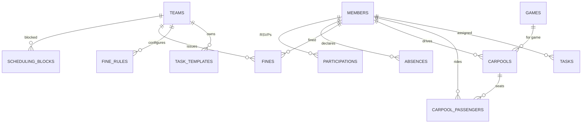
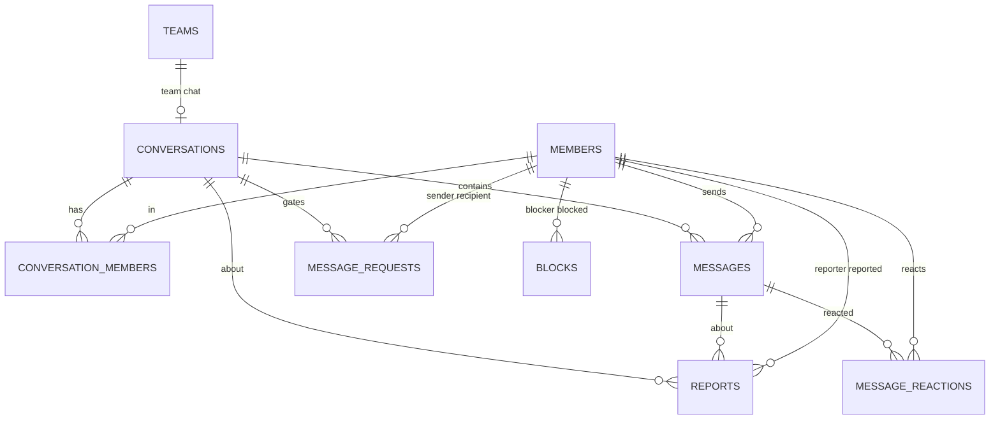
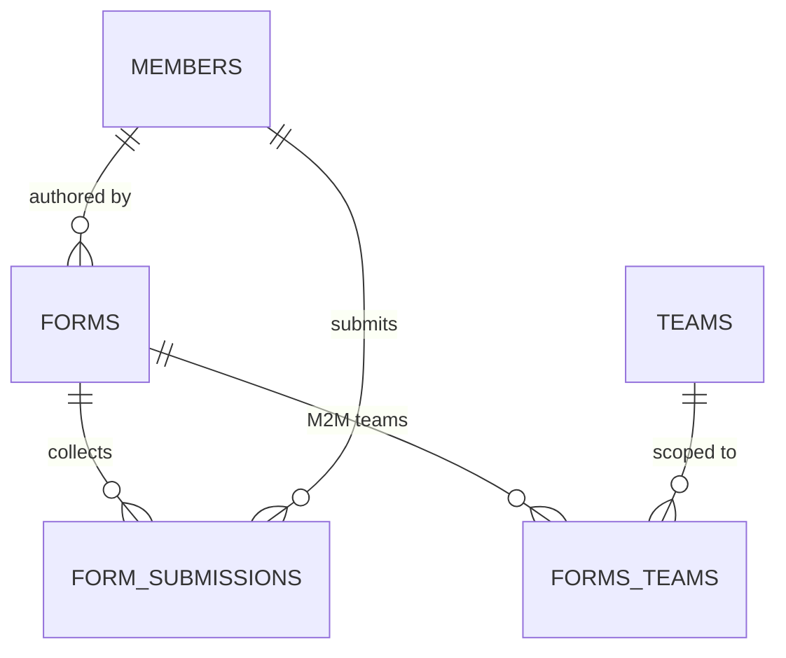
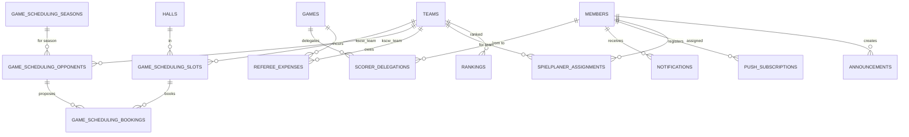

# Layer 2 — Data Model

Backend is Directus on Postgres (Supabase). Tables live in the `public` schema; primary keys are mostly serial `integer`, with messaging tables and a few others on `uuid`. Relationships are a mix of DB-level foreign keys (listed in `SCHEMA.sql`) and Directus-metadata-only relations inferred from `<entity>` column naming (`team`, `member`, `kscw_team`, `hall`, `hall_slot`, `game`, `activity_id`); only the former are marked as enforced FKs below. `members.user` and several `*_by`/`user_*` columns point at `directus_users.id` (a `uuid`) outside the app schema.

Domain groups: **people**, **scheduling**, **participation**, **messaging**, **forms**, **admin/infra**.

---

## People (teams, members, rosters, sponsors)

| Collection | Key columns | Relationships | Purpose |
|---|---|---|---|
| `members` | `id`, `email`, `first_name`, `last_name`, `role` (json), `position` (json), `user` (uuid→directus_users), `scorer_vb`/`referee_vb`/`otr1_bb`/`otr2_bb`/`otn_bb`/`referee_bb`, `kscw_membership_active`, `wiedisync_active`, `shell`, `hide_email`/`hide_phone`, `consent_decision`, `requested_team` | `requested_team`→teams (inferred); referenced by almost every collection | People — players, coaches, staff. Per-flag licence booleans (migration 067); messaging/consent + ClubDesk-sync fields. |
| `teams` | `id`, `name`, `full_name`, `team_id`, `sport`, `league`, `season`, `color`, `captain`, `features_enabled` (json), `recruiting_positions` (jsonb), `dashboard_range_from/_to/_league_only` | `captain`→members (FK, SET NULL); M2M coaches/TR/sponsors; o2m member_teams | Team entity. `captain` is M2O FK; coaches/TR/sponsors are M2M junctions. |
| `member_teams` | `id`, `member`, `team`, `season`, `guest_level` | `member`→members (FK CASCADE); `team`→teams (inferred); UNIQUE(member,team) | Roster junction. `guest_level` 0=member, 1-3=guest tiers. |
| `sponsors` | `id`, `name`, `logo` (uuid), `website_url`, `sort_order`, `active`, `team_page_only` | M2M teams via teams_sponsors | Club/team sponsors. `sponsors_with_logo` view joins storage for logo URL. |
| `team_invites` | `id`, `token`, `team`, `invited_by`, `claimed_by`, `guest_level`, `status`, `expires_at` | `team`/`invited_by`/`claimed_by` (inferred) | Tokenized team-join invites (shell-account flow). |
| `team_requests` | `id`, `member`, `team`, `status` | `member`→members (FK), `team`→teams (FK) | Member-initiated request to join a team (coach approval). |

---

## Scheduling (trainings, games, events, halls, slots)

| Collection | Key columns | Relationships | Purpose |
|---|---|---|---|
| `trainings` | `id`, `team`, `hall_slot`, `hall`, `date`, `start_time`, `end_time`, `cancelled`, `min_participants`, `excluded_guest_levels` (jsonb), `auto_confirm_rsvp`, `is_trial`, `auto_cancelled_by_closure`, `auto_cancelled_by_trial` | `team`→teams, `hall_slot`→hall_slots, `hall`→halls (all inferred) | A scheduled training session for one team. |
| `games` | `id`, `game_id`, `kscw_team`, `home_team`, `away_team`, `hall`, `additional_halls` (json), `date`, `time`, `league`, `type`, `status`, `home_score`/`away_score`, scorer/scoreboard/bb duty member+team cols, `source`, `svrz_push_status` (enum) | `kscw_team`→teams, `hall`→halls, many `*_member`→members, `*_duty_team`→teams (inferred) | League/manual game. Carries volleyball + basketball duty assignments inline. |
| `events` | `id`, `title`, `event_type`, `start_date`, `end_date`, `all_day`, `location`, `hall`, `participation_mode`, `invited_roles` (json), `cancelled`, `created_by` | `hall`→halls, `created_by`→members (inferred); M2M teams + members | Club/team event (social, tournament, meeting…). |
| `event_sessions` | `id`, `event`, `date`, `start_time`, `end_time`, `label`, `sort_order` | `event`→events (FK CASCADE) | Sub-sessions of a per-session event. |
| `halls` | `id`, `name`, `address`, `city`, `courts`, `homologation`, `sv_hall_id`, `maps_url` | referenced by trainings/games/events/slots/closures | Sports hall master data. |
| `hall_slots` | `id`, `hall`, `day_of_week`, `start_time`, `end_time`, `slot_type`, `recurring`, `valid_from`/`valid_until`, `indefinite`, `sport` | `hall`→halls (inferred); M2M teams via hall_slots_teams | Recurring hall booking template (Hallenplan). Virtual slots merged at display time. |
| `hall_closures` | `id`, `hall`, `start_date`, `end_date`, `reason`, `source` | `hall`→halls (inferred) | Hall closed for a date range (auto-cancels trainings). |
| `hall_events` | `id`, `uid`, `title`, `date`, `start_time`, `end_time`, `source` | M2M halls via hall_events_halls | External (GCal/iCal) hall-blocking events. |
| `slot_claims` | `id`, `hall_slot`, `hall`, `claimed_by_team`, `claimed_by_member`, `date`, `freed_reason`, `status` | `claimed_by_member`→members (FK CASCADE); `hall_slot`/`hall`/`claimed_by_team` (inferred) | A team claiming a freed hall slot. |

---

## Participation (RSVPs, absences, blocks, carpool, tasks, fines)

> `participations`, `absences`, `tasks`, `fines` use a polymorphic `(activity_type, activity_id)` pair (`training`/`game`/`event`) rather than per-type FKs — they are NOT hard FKs.

| Collection | Key columns | Relationships | Purpose |
|---|---|---|---|
| `participations` | `id`, `member`, `activity_type`, `activity_id`, `status`, `note`, `guest_count`, `is_staff`, `auto_declined_by`, `last_status_edited_by`/`last_note_edited_by` (uuid) | `member`→members (FK CASCADE); polymorphic activity (inferred) | One RSVP row per member×activity. Edit-attribution + auto-decline markers. |
| `absences` | `id`, `member`, `start_date`, `end_date`, `type` (standard/weekly), `affects` (json), `days_of_week` (json), `indefinite`, `blocking`, `last_edited_by/_name/_role` | `member`→members (FK CASCADE) | Player unavailability. `blocking` gates game-scheduling availability. |
| `scheduling_blocks` | `id`, `team`, `start_date`, `end_date`, `reason`, `created_by` | `team`→teams (FK CASCADE), `created_by`→members (FK SET NULL) | Team-level game-scheduling blackout (coach/TR-managed). |
| `fines` | `id`, `member`, `team`, `category`, `amount`, `status`, polymorphic `activity_type`/`activity_id`/`activity_date`, `tier_offense`, `issued_by`, `paid_*`, `waived_*` | `member`/`team` (FK CASCADE), several `*_by`→members (FK SET NULL) | Per-member fine ledger; amount snapshotted at issue. |
| `fine_rules` | `id`, `team`, `category`, `enabled`, `reset_window`, `tiers` (jsonb), `currency`, `updated_by` | `team`→teams (FK CASCADE), `updated_by`→members (FK SET NULL); UNIQUE(team,category) | Per-team×category escalation-tier config. |
| `carpools` | `id`, `game`, `driver`, `seats_available`, `departure_time`, `status` | `driver`→members (FK CASCADE); `game`→games (inferred) | Ride-share offer for a game. |
| `carpool_passengers` | `id`, `carpool`, `passenger`, `status` | `carpool`→carpools (FK CASCADE), `passenger`→members (FK CASCADE) | Passenger sign-up on a carpool. |
| `tasks` | `id`, `activity_type`, `activity_id`, `label`, `category`, `assigned_to`, `claimed_by`, `completed`, `created_by` | members refs (inferred); polymorphic activity | Per-activity to-do items. |
| `task_templates` | `id`, `name`, `team`, `tasks_json` (json), `created_by` | `team`→teams, `created_by`→members (inferred) | Reusable task checklist per team. |
| `polls` | `id`, `team`, `conversation` (uuid), `question`, `options` (json), `mode`, `deadline`, `status`, `anonymous` | `conversation`→conversations (FK CASCADE); `team`→teams (inferred); CHECK(team OR conversation) | Team or in-chat poll. |
| `poll_votes` | `id`, `poll`, `member`, `selected_options` (json) | `poll`→polls (FK CASCADE), `member`→members (FK CASCADE) | One vote row per member×poll. |

---

## Messaging (conversations, messages, requests, blocks, reports)

> Messaging tables use `uuid` PKs. `conversations.type` ∈ team/dm/dm_request/activity_chat/group_dm (CHECK-shaped); `activity_chat` carries `(activity_type='event', activity_id)`.

| Collection | Key columns | Relationships | Purpose |
|---|---|---|---|
| `conversations` | `id` (uuid), `type`, `title`, `team`, `created_by`, `last_message_at`, `activity_type`/`activity_id` | `team`→teams (FK CASCADE), `created_by`→members (FK SET NULL) | Chat thread: team, DM, group DM, or event activity chat. |
| `conversation_members` | `id` (uuid), `conversation`, `member`, `role`, `last_read_at`, `muted`, `archived` | `conversation`→conversations (FK CASCADE), `member`→members (FK CASCADE); UNIQUE(conversation,member) | Membership + read-state per conversation. |
| `messages` | `id` (uuid), `conversation`, `sender`, `type`, `body`, `poll`, `edited_at`, `deleted_at` | `conversation`→conversations (FK CASCADE), `sender`→members (FK CASCADE), `poll`→polls (FK SET NULL) | A single chat message (text or poll). |
| `message_reactions` | `id` (uuid), `message`, `member`, `emoji` | `message`/`member` (FK CASCADE); UNIQUE(message,member,emoji) | Emoji reaction on a message. |
| `message_requests` | `id` (uuid), `conversation`, `sender`, `recipient`, `status` | `conversation`/`sender`/`recipient` (FK CASCADE) | DM-request gating (accept before chatting). |
| `blocks` | `id` (uuid), `blocker`, `blocked` | both →members (FK CASCADE); CHECK(blocker≠blocked) | Member-to-member block. |
| `reports` | `id` (uuid), `reporter`, `reported_member`, `message`, `conversation`, `reason`, `status`, `message_snapshot`, `resolved_by` | all member/message/conversation refs FK SET NULL | Abuse report on a message/member. |

---

## Forms (internal + public forms)

| Collection | Key columns | Relationships | Purpose |
|---|---|---|---|
| `forms` | `id`, `title`, `status` (draft/open/closed), `audience` (club_wide/teams), `fields` (jsonb schema), `anonymous`, `allow_multiple`, `opens_at`/`closes_at`, `is_public`, `slug`, `created_by` | `created_by`→members (FK SET NULL); M2M teams via forms_teams; UNIQUE slug | Internal/public form definitions (migrations 086-089). `fields` keyed JSON drives `answers`. |
| `form_submissions` | `id`, `form`, `member`, `answers` (jsonb), `submitted_at` | `form`→forms (FK CASCADE), `member`→members (FK SET NULL, null=anonymous) | One submission row; `answers` keyed by field id. |
| `forms_teams` | `id`, `forms_id`, `teams_id` | `forms_id`→forms (FK CASCADE), `teams_id`→teams (FK CASCADE) | M2M junction scoping a `teams`-audience form to teams (mirrors events_teams). |

---

## Admin / Infra (sync, logs, registrations, game-scheduling, scorer, integrations)

| Collection | Key columns | Relationships | Purpose |
|---|---|---|---|
| `notifications` | `id`, `member`, `type`, `title`, `body`, `activity_type`, `activity_id`, `team`, `read` | `member`→members (FK CASCADE); `team` (inferred) | In-app notification feed. |
| `push_subscriptions` | `id`, `member`, `endpoint`, `keys_p256dh`, `keys_auth` | `member`→members (FK CASCADE) | Web-push subscription per device. |
| `announcements` | `id`, `image` (uuid), `pinned`, `published_at`, `audience_type`/`_sport`/`_teams`/`_roles`, `translations` (json), `notify_push`/`notify_email`, `created_by`, `fanout_sent_at` | `created_by`→members (FK SET NULL) | Vereinsnews posts with per-locale translations + fanout. |
| `rankings` | `id`, `team`, `team_id`, `league`, `rank`, `played`/`won`/`lost`, `sets_won`/`sets_lost`, `points`, `season` | `team`→teams (inferred) | League standings (synced from Swiss Volley / Basketplan). |
| `referee_expenses` | `id`, `game`, `team`, `paid_by_member`, `paid_by_other`, `amount`, `recorded_by` | members refs (inferred); `game`/`team` (inferred) | Reimbursement record for referee fees. |
| `scorer_delegations` | `id`, `game`, `role`, `from_member`, `to_member`, `from_team`, `to_team`, `same_team`, `status` | `from_member`/`to_member`→members (FK CASCADE); `game`/teams (inferred) | Transfer of a scorer/duty assignment between members. |
| `scorer_courses` | `id`, `slug_id`, `title_de`/`title_en`, `date_iso`, `mode`, `form_slug_de`/`_en` | standalone | Scorer-course listings (public website). |
| `spielplaner_assignments` | `id` (uuid), `member`, `kscw_team`, `user_created` (uuid) | `member`/`kscw_team` (FK CASCADE) | Grants a member Spielplaner rights on a team. |
| `game_scheduling_seasons` | `id`, `season`, `status`, `spielsamstage` (json), `team_slot_config` (json), `gap_config` (jsonb), `svrz_season_uuid` | referenced by opponents/slots/bookings | Per-season Terminplanung config. |
| `game_scheduling_opponents` | `id`, `season`, `club_name`, `team_name`, `contact_*`, `kscw_team`, `token`, `home_game`, `away_game`, `status`, `source`, `language` | `season`→game_scheduling_seasons (FK SET NULL); `kscw_team`/games (inferred) | Tokenized opponent invite for game scheduling. |
| `game_scheduling_slots` | `id`, `season`, `kscw_team`, `date`, `start_time`/`end_time`, `hall`, `source`, `status`, `booking`, `game` | `kscw_team`/`hall`/`booking`/`game` (inferred) | Offered home slot for opponent booking. |
| `game_scheduling_bookings` | `id`, `season`, `type`, `opponent`, `game`, `slot`, `proposed_datetime_1..3`, `proposed_slot_1..3`, `confirmed_proposal`, `status` | `opponent`/`game`/`slot` (inferred) | Home-slot pick or away-proposal booking. |
| `registrations` | `id`, `status`, `membership_type`, name/address fields, `team`, `id_upload_front`/`_back` (uuid), `bb_doc_*` (uuid), `locale` | standalone (pre-member intake) | Public membership-registration submissions. |
| `event_signups` | `id`, `event`, `form_slug`, `name`, `email`, `is_member`, `member`, `form_data` (jsonb), `consent` (jsonb) | `event`→events (FK CASCADE), `member`→members (FK SET NULL) | Public event signup (non-member-friendly). |
| `sv_vm_check` | `id`, `association_id`, names, `licence_*`, `is_writer`, `is_referee`, `referee_assoc`, `team_ids`, `synced_at` | drives `members.scorer_vb`/`referee_vb` | Volleymanager licence-sync snapshot. |
| `svrz_games` | `id` (uuid), `svrz_persistence_id`, `svrz_number`, `status`, home/away club+team, `league_*`, `raw` (json) | standalone | Mirror of SVRZ indoor-league games. |
| `svrz_spielplaner_contacts` | `id` (uuid), `svrz_persistence_id`, `season_uuid`, `club_*`, `person_*`, `contact_*`, `raw` (json) | standalone | SVRZ per-club scheduling contacts. |
| `vm_vb_spielplan_contact` | `id`, `FirstName`, `LastName`, `Email`, `Language` | standalone | Volleymanager scheduling-contact cache. |
| `sync_runs` | `source` (PK), `last_run_at`, `status`, `rows_changed`, `duration_ms`, `error_message` | standalone | Per-cron heartbeat (read by /status). |
| `kscw_migrations` | `filename` (PK), `sha256`, `applied_at`, `applied_by` | standalone | Migration-runner journal (apply-once + sha guard). |
| `user_logs` | `id`, `user`, `action`, `collection_name`, `record_id`, `data` (json) | `user`→members (FK CASCADE) | Audit log of member CRUD actions. |
| `error_annotations` | `id`, `error_hash`, `error_date`, `status`, `note`, `resolved_commit`, `user_created` (uuid) | standalone | Triage notes on persisted error-log entries. |
| `bugfix_jobs` | `id`, `error_hash`, `status`, `pr_number`/`pr_url`/`pr_branch`, `fix_summary`, `repo`, `triggered_by` (uuid) | standalone | Auto-bugfix job tracking (PR lifecycle). |
| `feedback` | `id`, `type`, `title`, `description`, `status`, `github_issue`, `screenshot` (uuid), `user` | `user`→members (inferred) | In-app feedback / bug reports. |
| `app_settings` | `id`, `key`, `enabled` | standalone | Global feature flags (key/enabled). |
| `password_reset_tokens` | `id`, `user` (uuid), `token_hash`, `expires_at` | `user`→directus_users (inferred) | Self-serve password-reset tokens. |
| `email_verifications` | `id`, `email`, `token`, `code`, `verified`, `expires_at` | standalone | Email-verification codes (registration). |
| `broadcasts` | `id`, `activity_type`, `activity_id`, `sender`, `channels_sent` (jsonb), `audience_filter` (jsonb), `recipient_ids` (jsonb), `message` | `sender`→members (FK SET NULL); polymorphic activity | Sent broadcast (email/push) audit record. |
| `news` | `id`, `title`/`title_en`, `slug`, `body`, `category`, `published_at`, `is_published`, `image` (uuid) | standalone | Public website news articles. |
| `newsletter_subscribers` | `id`, `email`, `locale`, `categories` (json), `verified`, `verify_token`, `unsubscribe_token` | standalone | Public newsletter list. |
| `volley_feedback` | `id` (uuid), `season`, `is_anonymous`, `name`, `functions`/`teams` (json), `rating_*`, `feedback_text` | standalone | Annual volleyball-section feedback survey. |
| `website_admin_access` | `id`, `user` (uuid), `sections` (jsonb) | `user`→directus_users (inferred) | kscw-website /admin per-user section grants. |
| `clubdesk_export` | `row_id` (PK), 60+ German text cols, `clubdesk_id`, `email`, `sektion` | feeds `clubdesk_people`/`_volleyball`/`_basketball` views | Raw ClubDesk member export (sync source). |
| `clubdesk_export_meta` | `id`(=1), `last_import_at`, `source_file`, `row_count` | singleton | Last-import metadata for ClubDesk export. |

---

## Junction tables (M2M) reference

| Junction table | Links A | Links B |
|---|---|---|
| `member_teams` | `members` (member) | `teams` (team) — roster, with `guest_level`/`season` payload |
| `teams_coaches` | `teams` (teams_id) | `members` (members_id) — team coaches |
| `teams_responsibles` | `teams` (teams_id) | `members` (members_id) — team responsibles (TR) |
| `teams_sponsors` | `teams` (teams_id) | `sponsors` (sponsors_id) |
| `events_teams` | `events` (events_id) | `teams` (teams_id) — invited teams |
| `events_members` | `events` (events_id) | `members` (members_id) — individually invited members |
| `forms_teams` | `forms` (forms_id) | `teams` (teams_id) — team-scoped forms |
| `hall_slots_teams` | `hall_slots` (hall_slots_id) | `teams` (teams_id) — slot ownership |
| `hall_events_halls` | `hall_events` (hall_events_id) | `halls` (halls_id) — multi-hall blocking |
| `carpool_passengers` | `carpools` (carpool) | `members` (passenger) — ride sign-up, with `status` payload |

> Not junctions despite the name: `teams.captain` is a true M2O FK to `members`; `spielplaner_assignments` is an entity (uuid PK + audit cols) linking `members`↔`teams`, not a bare M2M.
