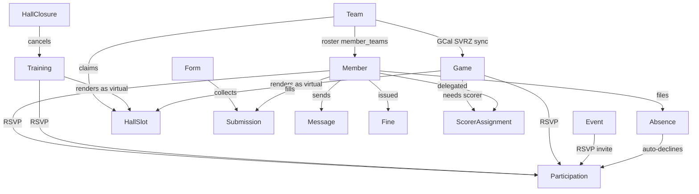
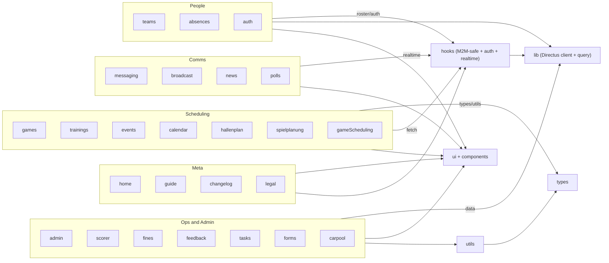

# Layer 2 — Features & Domain Flows

Knowledge graph of the 25 feature modules under `src/modules/` in the KSCW "wiedisync" React app (React 19 + Vite + TS). Each module is a vertical slice (page + components + local hooks); they share a thin foundation of cross-cutting areas — `lib` (Directus client + query layer), `hooks` (M2M-safe fetch + auth + realtime), `utils`, `types`, `ui` (shadcn primitives) and `components` (KSCW wrappers). Data flows are derived from `docs/code-graph/import-graph.json` (the exact import graph) plus the participation/absence/roster connective tissue.

## Module map

| Module | Purpose (1 line) | Entry file(s) | Leans on (top 3 areaDeps) | loc |
|---|---|---|---|---|
| admin | Admin console — infra/data health, audit log, referee expenses, club stats, announcements, anmeldungen, SQL workspace, data explorer | `modules/admin/InfraHealthPage.tsx`, `modules/admin/StatusPage.tsx`, `modules/admin/ExplorePage.tsx` | lib, ui, utils | 11299 |
| hallenplan | Hall-plan slot scheduling — virtual slots merge games/trainings/GCal at display time, closures cancel trainings | `modules/hallenplan/HallenplanPage.tsx`, `modules/hallenplan/utils/virtualSlots.ts` | types, utils, components | 4887 |
| gameScheduling | SVRZ game-scheduling invites — admin tokenized per-verein links + opponent booking flow | `modules/gameScheduling/pages/AdminDashboardPage.tsx`, `modules/gameScheduling/pages/OpponentFlowPage.tsx` | types, lib, ui | 4075 |
| calendar | Unified month/week calendar aggregating games, trainings, absences and hall slots | `modules/calendar/CalendarPage.tsx`, `modules/calendar/hooks/useCalendarData.ts` | types, utils, components | 3835 |
| games | League games — cards, detail modal, scoreboard, rankings table, referee expenses, RSVP | `modules/games/GamesPage.tsx`, `modules/games/components/GameDetailModal.tsx` | utils, types, components | 3483 |
| auth | Auth + profile — login, sign-up, OAuth callback, join/set-password, pending, profile edit | `modules/auth/LoginPage.tsx`, `modules/auth/SignUpPage.tsx`, `modules/auth/ProfilePage.tsx` | hooks, ui, components | 3080 |
| messaging | In-app messaging — inbox, conversations, DMs/group DMs, threads, settings | `modules/messaging/pages/InboxPage.tsx`, `modules/messaging/api/messaging.ts` | ui, hooks, utils | 3061 |
| teams | Team roster management — team detail, roster editor, player profile, sponsors | `modules/teams/TeamsPage.tsx`, `modules/teams/RosterEditor.tsx`, `modules/teams/TeamDetail.tsx` | components, lib, types | 2992 |
| scorer | Schreibereinsätze — scorer assignment algorithm, delegation, assignment editor | `modules/scorer/ScorerPage.tsx`, `modules/scorer/ScorerAssignPage.tsx` | types, utils, components | 2914 |
| trainings | Trainings — form, recurring generator, detail modal, attendance stats, RSVP | `modules/trainings/TrainingsPage.tsx`, `modules/trainings/TrainingForm.tsx` | components, types, utils | 2848 |
| spielplanung | Spielplanung sandbox — manual game CRUD on calendar, Excel import, drag-to-reschedule week view | `modules/spielplanung/SpielplanungPage.tsx`, `modules/spielplanung/ManualGameModal.tsx` | types, utils, lib | 2841 |
| absences | Absences + weekly unavailability — forms, team absence view, import; auto-declines participations | `modules/absences/AbsencesPage.tsx`, `modules/absences/TeamAbsenceView.tsx` | types, ui, components | 2595 |
| events | Club/team events — form, detail modal, cards, RSVP and invites | `modules/events/EventsPage.tsx`, `modules/events/EventForm.tsx` | components, hooks, types | 2004 |
| forms | Internal forms — builder, fill modal, responses, public `/f/<slug>` page | `modules/forms/FormsPage.tsx`, `modules/forms/FormBuilderPage.tsx`, `modules/forms/PublicFormPage.tsx` | lib, ui, components | 1605 |
| home | Home dashboard — next appointments agenda, announcements, RSVP row strip | `modules/home/HomePage.tsx` | components, hooks, lib | 1456 |
| guide | Onboarding — React Joyride tours, install (PWA) prompt, guide page | `modules/guide/GuidePage.tsx`, `modules/guide/TourProvider.tsx` | ui, hooks | 1412 |
| fines | Team fines — issue/waive fine modals, settings, dashboard card | `modules/fines/FinesPage.tsx`, `modules/fines/IssueFineModal.tsx` | hooks, lib, types | 901 |
| broadcast | Broadcast email/push to an audience — dialog, preview, can-broadcast gate | `modules/broadcast/BroadcastDialog.tsx`, `modules/broadcast/BroadcastButton.tsx` | ui, components, lib | 830 |
| polls | Team polls — form, card, section, vote hook | `modules/polls/PollsSection.tsx`, `modules/polls/PollForm.tsx` | ui, types, hooks | 620 |
| tasks | Event/activity tasks — form, card, section | `modules/tasks/TasksSection.tsx`, `modules/tasks/TaskForm.tsx` | types, hooks, ui | 548 |
| feedback | Volleyball feedback submission page | `modules/feedback/FeedbackPage.tsx` | hooks, lib, ui | 484 |
| carpool | Carpool offers attached to games/events — card, offer form, section | `modules/carpool/CarpoolSection.tsx`, `modules/carpool/CarpoolOfferForm.tsx` | ui, types, hooks | 440 |
| legal | Static legal pages — Datenschutz + Impressum | `modules/legal/DatenschutzPage.tsx`, `modules/legal/ImpressumPage.tsx` | (none) | 262 |
| changelog | In-app "What's New" — versioned release notes | `modules/changelog/ChangelogPage.tsx` | ui | 257 |
| news | Vereinsnews archive page | `modules/news/NewsArchivePage.tsx` | components, hooks, lib | 241 |

## Cross-cutting data flows

Domain entities and the verbs between them. Participation is the hub: every schedulable activity RSVPs into it, and a covering Absence auto-declines those RSVPs (`utils/absenceHelpers.absenceCoversActivity`, enforced server-side by Postgres triggers + kscw-hooks). `hooks/useTeamMembers`, `useUserVisibleEventIds` and `lib/api` provide the M2M-safe fetch patterns that keep these joins from silently returning `[]` for non-admins.

## Feature clusters

The 25 modules grouped by domain, with each cluster's dominant shared-area dependencies. `app-root` (`App.tsx`) lazy-routes every page; `lib`/`hooks`/`utils`/`types`/`ui`/`components` are the shared foundation every cluster leans on.

### Cluster membership

- **Scheduling** — games, trainings, events, calendar, hallenplan, spielplanung, gameScheduling
- **People** — teams, absences, auth
- **Comms** — messaging, broadcast, news, polls
- **Ops and Admin** — admin, scorer, fines, feedback, tasks, forms, carpool
- **Meta** — home, guide, changelog, legal
